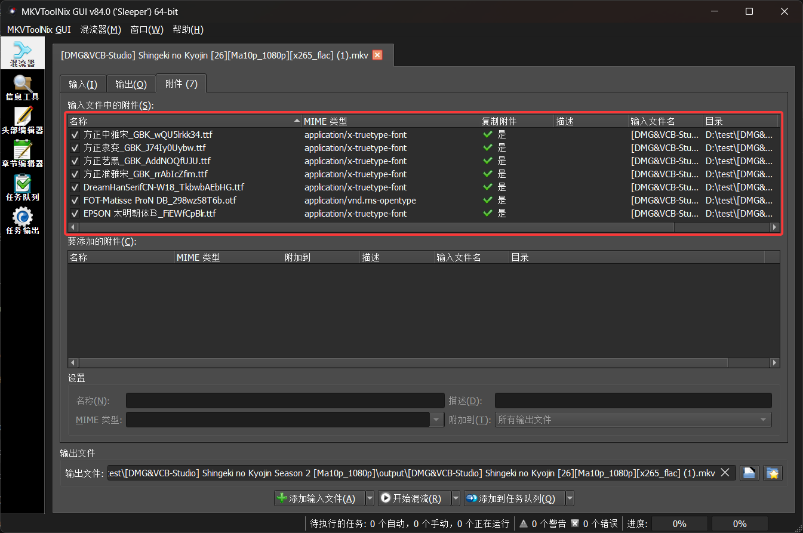

# MkvFontMux

[English](README.md)

MkvFontMux 是用于 MKV (Matroska) 的跨平台字幕自动化工具。本工具可以解析 ASS 字幕所需字体，子集化后调用 `mkvmerge` 进行压制。

## 环境要求

- .NET SDK 8.0+
- `mkvmerge` (来自 [MKVToolNix](https://mkvtoolnix.org/))
- `pyftsubset` (来自 [fontTools](https://github.com/fonttools/fonttools))

## 配置

**CLI**首次运行后会在其所在目录生成 `config.ini`，可在其中设置 `mkvmerge-bin`、`font-directory` 和 `pyftsubset-bin`。

如果不配置 `mkvmerge-bin` 和 `pyftsubset-bin` 则遍历 PATH，不配置 `font-directory` 则使用系统字体目录。

示例：

```ini
# MkvFontMux 默认设置
# 多个目录请用 ; 分隔
mkvmerge-bin=D:\Program Files\MKVToolNix\mkvmerge.exe
font-directory=H:\Fonts;H:\MoreFonts
pyftsubset-bin=C:\Python\Scripts\pyftsubset.exe
```

## 使用示例

从 [Release](https://github.com/Shizuku-in/mkvfontmux/releases/) 下载，并执行命令 `MkvFontMux.exe "[DMG&VCB-Studio] Shingeki no Kyojin Season 2 [Ma10p_1080p]" -d Fonts`。

或者从源码构建运行：

```powershell
dotnet run --project MkvFontMux.Console -- "[DMG&VCB-Studio] Shingeki no Kyojin Season 2 [Ma10p_1080p]" -d Fonts
```



## GUI

从 [Release](https://github.com/Shizuku-in/mkvfontmux/releases/) 下载并运行

或者从源码构建运行：

```powershell
dotnet build MkvFontMux.sln -c Debug
dotnet run --project MkvFontMux.Gui
```

## 说明

### 默认配置

- `mkvmerge-bin`: CLI 参数 > `config.ini` > PATH
- `pyftsubset-bin`: CLI 参数 > `config.ini` > PATH
- `font-directory`: CLI 参数 > `config.ini` > 下表

| Platform | Directory |
|---|---|
|Windows| `%WINDIR%\Fonts`, `%LOCALAPPDATA%\Microsoft\Windows\Fonts`|
|macOS|`/Library/Fonts`, `/System/Library/Fonts`, `~/Library/Fonts`|
|Linux|`/usr/share/fonts`, `~/.local/share/fonts`|

### 语言代码映射

|Order| Keyword | Code |
|---|---|---|
|1| `sc`, `chs`, `zhs`, `zh-cn`, `gb`, `gbk`, `gb2312`, `简体`, `简中` | `zh-Hans`  |
|2|  `tc`, `cht`, `zht`, `zh-tw`, `big5`, `繁体`, `繁中` | `zh-Hant` |
|3|`en`, `eng`, `english`, `英文`, `英字`| `eng`|
|4|`jp`, `ja`, `jpn`, `japanese`, `日文`, `日语`, `日字`|`jpn`|
|5| 未命中 | `--subtitle-language` 的值 (默认 `zh-Hans`)|

# 许可证

[MIT](LICENSE)