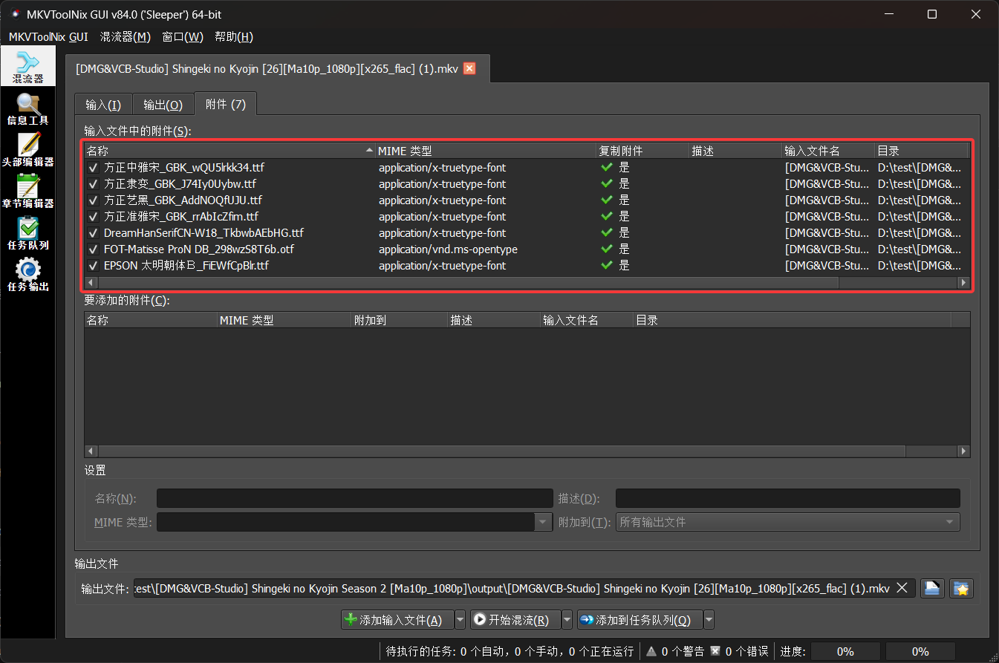

# MkvFontMux

MkvFontMux is a subtitle-font automation tool for MKV workflows.
It parses ASS subtitles, matches fonts, subsets fonts, rewrites subtitle font names, and muxes output with `mkvmerge`.

## Requirements

- .NET SDK 8.0+
- `mkvmerge` (from [MKVToolNix](https://mkvtoolnix.org/))
- `pyftsubset` available in PATH, or specify its path with CLI/config

## CLI Options

- `--mkvmerge-bin <path>`, `-m`
- `--force-match`, `-f`
- `--font-directory <d1;d2>`, `-d`
- `--disable-subset`, `-n`
- `--save-log`, `-l`
- `--overwrite`, `-o`
- `--remove-temp`, `-r`
- `--only-print-matchfont`, `-p`
- `--subtitle-language <code>`, `-s` (default/fallback: `chi`; ASS filename keyword auto-detect supports Simplified Chinese: `sc/chs/zhs/zh-cn/gb/gbk/...`, Traditional Chinese: `tc/cht/zht/zh-tw/big5/...`, English: `en/eng/...`, Japanese: `jpn/ja/jp/...`)
- `--pyftsubset-bin <path>`, `-y`

## Default Config

On first run, the **CLI app** creates `config.ini` in the executable directory.
Use it to set defaults for `mkvmerge-bin`, `font-directory`, and `pyftsubset-bin`.

Example:

```ini
# MkvFontMux default settings
# Use ';' to separate multiple directories.
mkvmerge-bin=D:\Program Files\MKVToolNix\mkvmerge.exe
font-directory=H:\Fonts;H:\MoreFonts
pyftsubset-bin=C:\Python\Scripts\pyftsubset.exe
```

## Example

Run `MkvFontMux.exe "[DMG&VCB-Studio] Shingeki no Kyojin Season 2 [Ma10p_1080p]" -d Fonts`

Or build and run from source:

```powershell
dotnet run --project MkvFontMux.Console -- "[DMG&VCB-Studio] Shingeki no Kyojin Season 2 [Ma10p_1080p]" -d Fonts
```



## GUI

Build and run from source:

```powershell
dotnet build MkvFontMux.sln -c Debug
dotnet run --project MkvFontMux.Gui
```

## Notes

- If `--disable-subset` is used, original font files are attached instead of subsets.
- If no matching ASS files are found for an MKV, that file is skipped.
- If no MKV files exist in the target directory, execution exits early.
